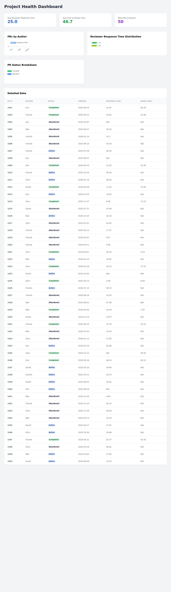

# ADO Health Reporter

This project provides a comprehensive project health report for Azure Repos by analyzing Pull Request (PR) data. It generates a CSV report containing key engagement and performance metrics and includes a modern, lightweight dashboard to visualize the data.

## Features

*   **Engagement Filtering**: Extracts human-only comments (excluding system updates) to gauge genuine team interaction.
*   **Reviewer Performance**: Calculates "Response Time" (time from PR creation to first non-author comment/vote) to identify bottlenecks.
*   **Data Mapping**: Links PR authors to engagement levels and merge speeds.
*   **CSV Export**: Generates `ado_detailed_health.csv` for further analysis.
*   **Visual Dashboard**: A standalone HTML dashboard to visualize KPIs, charts, and detailed data.

## Metrics Explained

| Metric | The Question it Answers | Project Health Indicator |
|---|---|---|
| **Reviewer Response Hours** | How long does code sit idle before someone looks at it? | **Low Hours**: High team agility. <br> **High Hours (>24h)**: Context switching is killing productivity. |
| **Comment-to-Vote Ratio** | Are reviewers providing feedback or just voting? | **High Comments/No Vote**: Indicates "Nitpicking" or lack of clear standards. |
| **The 'Solo' Reviewer** | Is one person reviewing 80% of the PRs? | **High Concentration**: A single point of failure (SPOF) for the entire repo. |
| **Hours to Merge** | How long does it take for a "done" feature to get merged? | Helps in setting realistic expectations for Sprint Planning. |

## Prerequisites

*   Node.js (v14 or later)
*   Azure DevOps Personal Access Token (PAT) with **Code (Read)** permissions.

## Setup

1.  **Clone the repository:**
    ```bash
    git clone <repo-url>
    cd ado-health-reporter
    ```

2.  **Install dependencies:**
    ```bash
    npm install
    ```

3.  **Configure Environment Variables:**
    Create a `.env` file in the root directory:
    ```env
    ADO_ORG_URL=https://dev.azure.com/your-org
    ADO_PAT=your_personal_access_token
    ADO_REPO_ID=your_repository_id_or_guid
    ADO_PROJECT=your_project_name
    ```

## Usage

### Generating the Report

To connect to Azure DevOps and generate the real report:

```bash
npx ts-node src/generate-report.ts
```

This will create `ado_detailed_health.csv` in the root directory.

### Generating Mock Data (For Testing)

If you don't have an ADO connection yet, you can generate realistic mock data:

```bash
npx ts-node src/generate-mock-data.ts
```

### Viewing the Dashboard

1.  Ensure `ado_detailed_health.csv` is present in the root directory.
2.  Open `dashboard/index.html`.
    *   **Note**: Due to browser security restrictions (CORS), you cannot open the HTML file directly from the file system if it tries to load the CSV. You must serve it via a local server.
    *   **Quick Start**:
        ```bash
        # From the project root
        npx http-server .
        ```
    *   Navigate to `http://localhost:8080/dashboard/index.html`.

## Dashboard Preview



## How to Use the Output

*   **Spot Burnout**: Look for high `Reviewer_Response_Hours` + high volume of PRs for specific reviewers.
*   **Identify Silent Merges**: Filter for `Human_Comment_Count = 0`. These are high-risk merges.
*   **Optimize Planning**: Use the average `Hours_to_Merge` to better estimate feature delivery times.
