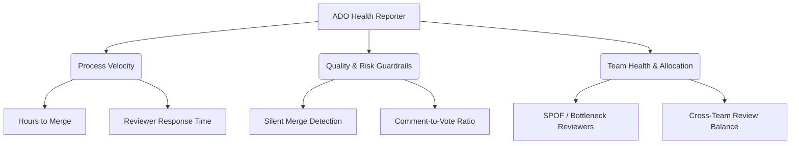

# Business Case: Engineering Observability in the Azure DevOps Ecosystem

## Executive Summary

Software engineering is one of the largest capital investments for modern enterprises, yet it remains one of the least observable business functions. While organizations invest heavily in application performance monitoring (APM) for production environments (e.g., Azure Application Insights, Datadog), the **software delivery process itself** remains a black box.

The **ADO Health Reporter** bridges this gap. By analyzing Git Pull Request (PR) logs and metadata, this utility transforms raw development activity into actionable operational intelligence. In an Azure-centric landscape, this tool serves as a key feedback loop—connecting developer behavior, code quality, and process velocity to business outcomes.

---

## 1. Core Observability Benefits in Azure Landscapes

In organizations utilizing **Azure DevOps**, **Azure Pipelines**, and the **Azure cloud landscape**, the ADO Health Reporter provides three core dimensions of day-to-day observability:



### A. Process Velocity Observability (Lead Time to Merge)
* **The Problem**: Features sit stalled in the code-review pipeline. Developers context-switch to new tasks, increasing cognitive load and slowing delivery.
* **Observability Solution**: By tracking **Reviewer Response Hours** and **Hours to Merge**, engineering leaders can see exactly where bottlenecks occur. 
* **Azure Integration**: These metrics correlate directly with Azure Pipeline queue times and deployment velocity. If build pipelines are slow, merge times climb, which is instantly visible in the dashboard trends.

### B. Quality & Risk Guardrails (Preventing Production Bugs)
* **The Problem**: A high percentage of PRs are merged with zero human comments ("Silent Merges") or immediate "rubber-stamp" approvals. This behavior is the leading indicator of technical debt and production defects.
* **Observability Solution**: Spotting high-risk merges (e.g., `Human_Comment_Count = 0` on critical repos) allows teams to intercept bugs before they hit build pipelines.
* **Azure Integration**: Correlating "Silent Merges" with **Azure Monitor Application Insights** crash rates or **Azure Boards** bug tickets helps teams identify high-risk codebases.

### C. Resource Health & SPOF Detection (Avoiding Burnout)
* **The Problem**: Code review duties often fall disproportionately on a small group of senior engineers, creating Single Points of Failure (SPOFs) and leading to burnout.
* **Observability Solution**: The dashboard maps code review distribution across authors, reviewers, and teams. Teams can actively rebalance review loads to unblock junior developers and protect senior staff.

---

## 2. Financial Return on Investment (ROI) Model

To illustrate the financial impact of engineering observability, let's look at a representative development team:

### Scenario Parameters
* **Team Size**: 20 Developers
* **Average Developer Cost**: $125,000 / year (fully loaded cost of ~$60 / hour)
* **Weekly PR Output**: ~30 PRs total (1.5 PRs per developer per week)

### Metric Improvement Calculations

#### Improvement 1: Context Switching & Idle Time Reduction
Unmonitored code reviews typically sit idle for **24–36 hours** before receiving initial feedback. When a PR is delayed, developers must context-switch to other tasks, costing an estimated **30 minutes of lost focus** per switch.

* **Before Observability**: Average Reviewer Response Time = 32 hours. Developers context-switch 3 times per PR while waiting.
* **After Observability**: By monitoring metrics weekly and adjusting review guidelines, average response time drops to **6 hours**. Context-switches drop to 1 per PR.
* **Time Saved**: 2 context-switches saved per PR.
  $$\text{Hours Saved/Week} = 30\text{ PRs} \times 2\text{ switches} \times 0.5\text{ hours} = 30\text{ hours/week}$$
  $$\text{Weekly Savings} = 30\text{ hours} \times \$60/\text{hour} = \$1,800$$
  $$\text{Annual Savings (Context Switching)} = \$1,800 \times 52\text{ weeks} = \mathbf{\$93,600}$$

#### Improvement 2: Production Incident Prevention (Defect Escape Ratio)
"Silent Merges" (PRs merged with zero discussion) are mathematically proven to result in a higher defect escape rate. Let's assume 15% of PRs (234 PRs annually) were previously merged silently, with 5% of those resulting in critical production defects. 
An average production outage in an Azure cloud environment (e.g., Azure App Service downtime or Database locking) costs **$8,000** in developer troubleshooting, patching, and business impact.

* **Action**: Teams flag and stop "Silent Merges", cutting the defect count in half (preventing ~6 critical production bugs per year).
  $$\text{Annual Savings (Incident Prevention)} = 6\text{ incidents} \times \$8,000/\text{incident} = \mathbf{\$48,000}$$

### Total Business Return
* **Total Annual Value Created**: **$141,600**
* **Cost to Implement Utility**: Negligible (setup is ~1 hour; running cost inside Azure Pipelines is virtually free).
* **ROI**: **> 1,000%** in Year 1.

---

## 3. Reference Architecture: Azure Landscape Integration

To turn this utility into a sustainable enterprise observability solution, it should be integrated directly into your Azure landscape:

```
[Azure Pipeline (Cron Schedule)] 
        │
        ▼
[ADO Health Reporter (npx ts-node)] 
        │
        ├───► [Export CSV] ───► [Azure Blob Storage ($web)] ───► [Static Dashboard App]
        │
        └───► [HTTP Post]  ───► [Azure Log Analytics]       ───► [Azure Workbooks / Alerts]
```

### A. Scheduled Extraction (Azure Pipelines)
Instead of running the utility manually, execute it nightly using a scheduled **Azure Pipeline YAML**:

```yaml
schedules:
- cron: "0 0 * * *" # Run every night at midnight
  displayName: "Daily Observability Data Load"
  branches:
    include:
    - main
  always: true

pool:
  vmImage: 'ubuntu-latest'

steps:
- task: NodeTool@0
  inputs:
    versionSpec: '18.x'
  displayName: 'Install Node.js'

- script: |
    npm install
    npx ts-node src/generate-report.ts
  env:
    ADO_ORG_URL: $(ADO_ORG_URL)
    ADO_PAT: $(System.AccessToken) # Securely uses built-in pipeline token
    ADO_REPO_ID: '*'              # Fetch all repositories
    ADO_PROJECT: $(System.TeamProject)
  displayName: 'Generate Health Report'
```

### B. Automated Dashboard Hosting (Azure Blob Storage)
Configure the pipeline to upload the resulting `ado_detailed_health.csv` and the `dashboard/` static folder to an **Azure Storage Account** enabled for **Static Website Hosting (`$web` container)**. 
This provides a secure, internal, and serverless dashboard accessible to your entire organization without hosting costs.

### C. Advanced Observability (Azure Workbooks & Monitor)
Instead of writing only to CSV, you can modify the export layer of the utility to push JSON records directly to **Azure Log Analytics** using the HTTP Data Collector API.
* **Benefits**:
  * Create **Azure Monitor Alerts** to email team leads when a repository's Average Response Time exceeds 24 hours.
  * Build interactive **Azure Workbooks** directly inside the Azure Portal, blending PR velocity metrics side-by-side with Azure Pipelines build success rates and Azure Boards sprint health widgets.
